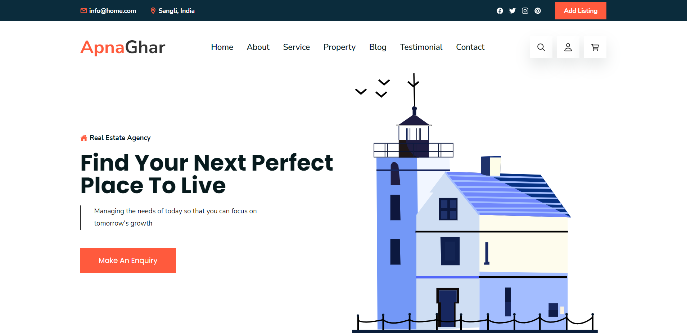
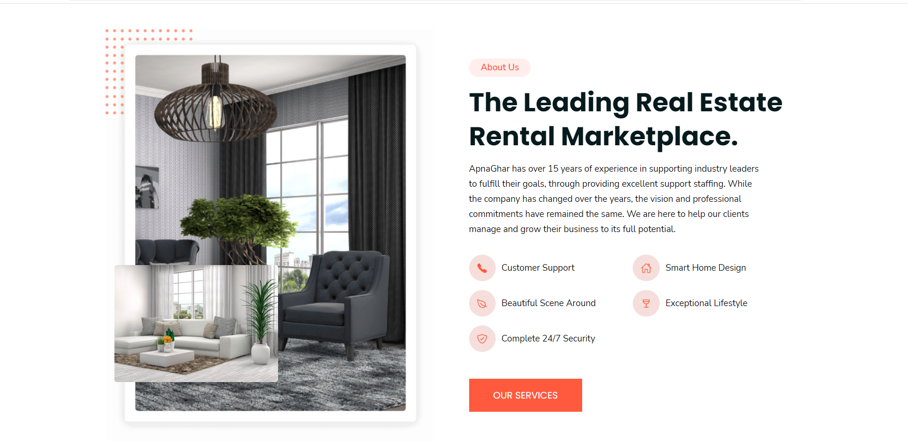
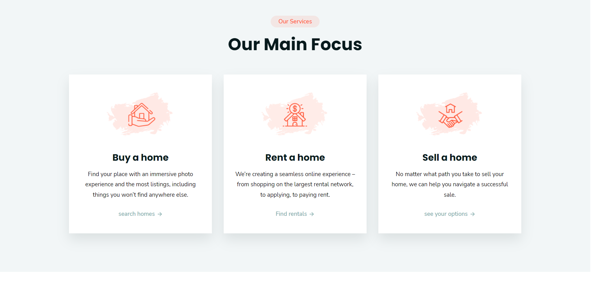
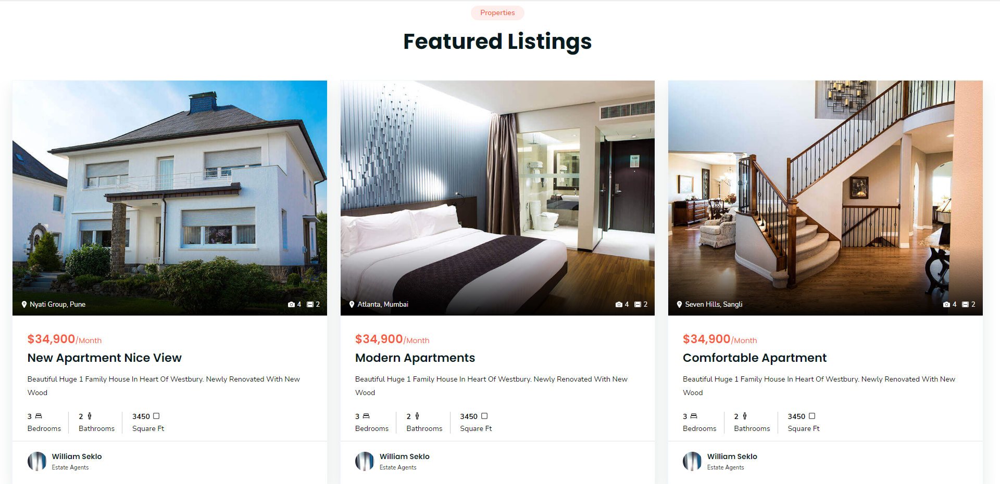
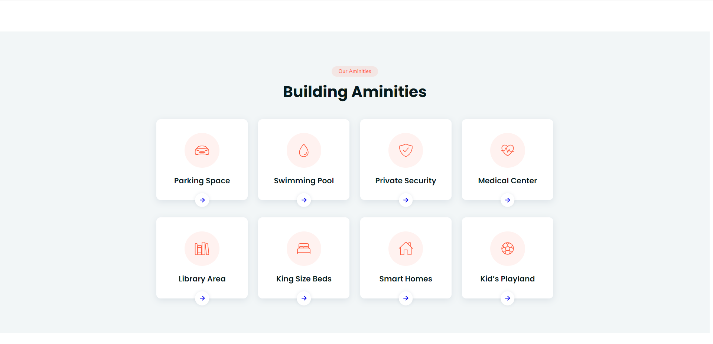
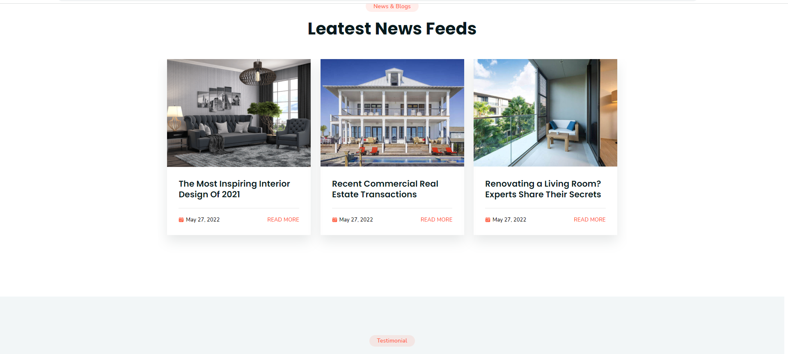
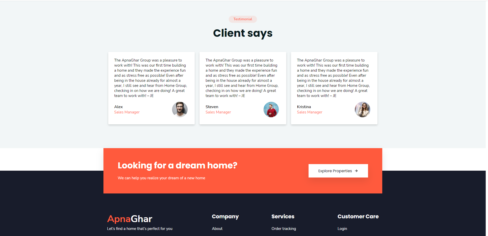
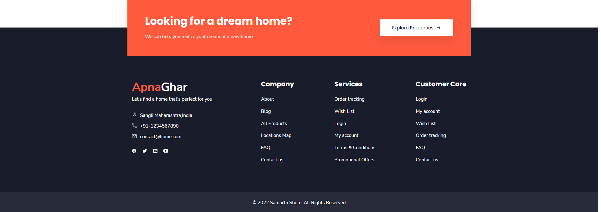

  
  
 
   
   
  
  
  <h2 align="center">ApnaGhar - Real estate website</h2>

  ApnaGhar is fully responsive Real estate website
  <a href="https://codewithsadee.github.io/homeverse/"><strong>➥ Live Demo</strong></a>

 

# ApnaGhar Real Estate Website

Real estate is one such business where the intensity of cutthroat competition never drops down. On one side everyone is looking for their dream house and on the other side, all the real estate businesses are trying their best to reach out to them. 
In all this running around, the easiest way to display your properties is a website.

ApnaGhar is website to advertise & sell their real estate projects such as an upcoming smart city, housing societies, residential or commercial towers and to help people to buy their dream house.
 

## Table of contents

- [Overview](#overview)
  - [The challenge](#the-challenge)
  - [Screenshot](#screenshot)
  - [Links](#links)
- [My process](#my-process)
  - [Built with](#built-with)
- [Author](#author)

## Overview

### Features
According to the stats from the National Association of Realtors, USA, 93% of people visit real estate websites while searching for homes. 
This means you can’t anymore be dependent on the advertisement poster on the subway.
ApnaGhar website is very simple, comprehensive, and easy to navigate.

Let’s look at some features:
1. Detailed Information
2. Interactive Maps
3. Search Box
4. Simple Menu
5. Large Footer

## Why you should visit
1. There are realtors
2. There are best sellers
3. Buy your house/flat
4. Sell your house/flat
5. Rent your house/flat	
6. User-friendly.

### The challenge

Users should be able to:

- View the optimal layout for the site depending on their device's screen size
- See hover states for all interactive elements on the page
- Responsive site
  
### Screenshot

### Links
 
- Live Site URL: [https://krrish105.github.io/Huddle-Landing-Page/](https://huddlelandingpage-newtonschool.netlify.app/)

## My process

### Built with

- Semantic HTML5 markup
- CSS custom properties
- Flexbox
- CSS Grid
- Mobile-first workflow

## Author

- Frontend Mentor - [SamarthShete](https://www.frontendmentor.io/profile/samarthshete)
- Linkedin - [_samarthshete](https://www.linkedin.com/in/samarthshete14/)
- Github - [samarthshete](https://github.com/samarthshete)
